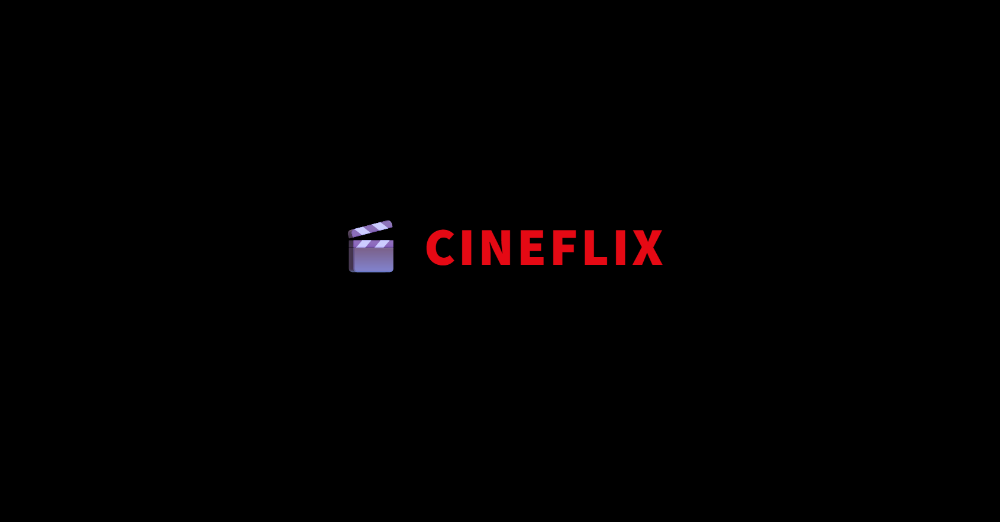
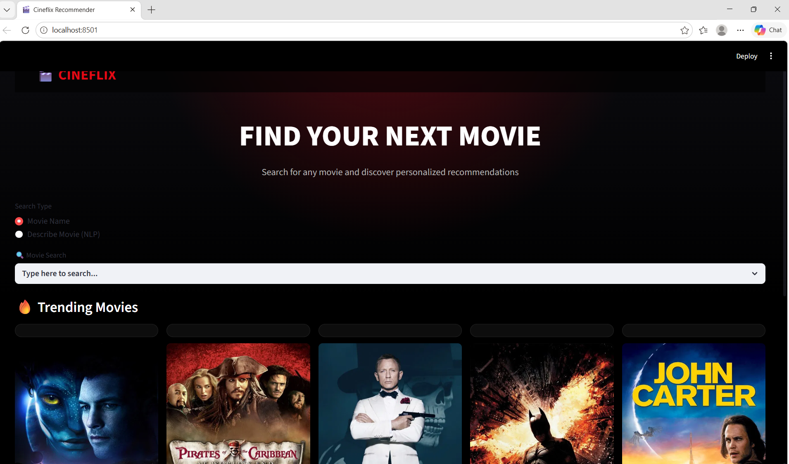
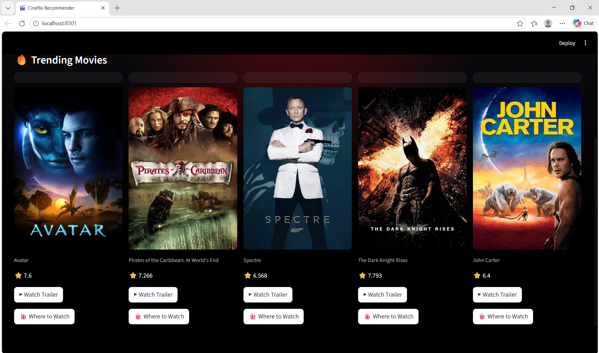
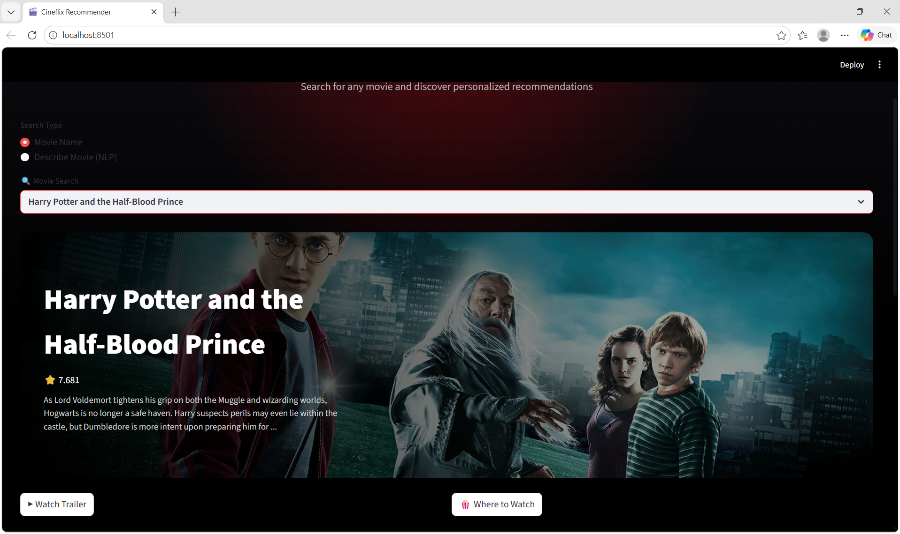
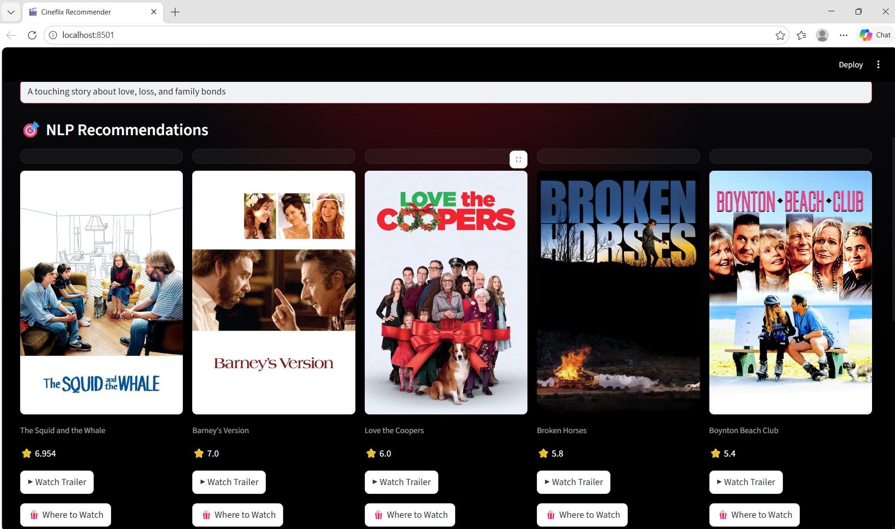
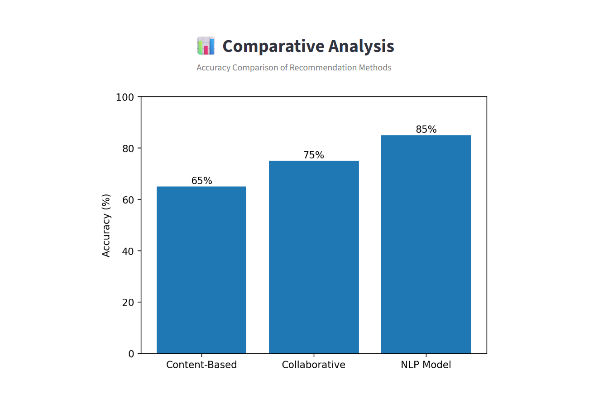

# 🎬 Cineflix – NLP-Based Movie Recommendation System

An intelligent movie recommendation system powered by **Natural Language Processing (NLP)** and **Machine Learning**, designed to help users discover movies based on their interests. Cineflix provides recommendations through both movie title search and natural language descriptions, while integrating real-time movie information from TMDB.

🌐 **Live Demo: https://movierecommendationsystem-cugmv2ldkf8qbvbuhzluqh.streamlit.app/


---

## 📖 Overview

Cineflix is a content-based movie recommendation system that uses Natural Language Processing techniques to recommend movies similar to a selected movie or a user-provided description.

The system leverages the **TMDB 5000 Movie Dataset**, processes movie metadata, and applies **TF-IDF Vectorization** and **Cosine Similarity** to identify relevant recommendations. It also integrates with the TMDB API to display movie posters, ratings, backdrops, trailers, and additional details.

The application is built using **Streamlit** and provides a modern, user-friendly interface for movie discovery.

---

## ✨ Features

### 🎥 Movie-Based Recommendations

* Search movies by title.
* Get similar movie recommendations instantly.
* View movie posters, ratings, and trailers.

### 🧠 NLP-Based Recommendations

* Enter a movie description in natural language.
* Receive recommendations based on the description.
* Examples:

  * Action adventure movies
  * Romantic comedy movies
  * Science fiction space movies
  * Superhero movies

### 🔥 Trending Movies

* Displays trending movies dynamically.
* Shows posters, ratings, and trailers.

### 🎬 TMDB API Integration

* Movie posters
* Ratings
* Backdrop images
* Movie details
* Official trailers

### 🍿 Watch Links

* Provides quick access to movie watch information.

### 🎨 Modern User Interface

* Netflix-inspired design
* Responsive layout
* Interactive movie cards
* Animated splash screen

### 📊 Comparative Analysis Dashboard

* Visual comparison of recommendation methods.
* Accuracy comparison chart using Matplotlib.

---

## 🏗️ System Workflow

1. User enters a movie title or movie description.
2. Movie metadata is retrieved from the dataset.
3. Text preprocessing is applied.
4. TF-IDF converts text into numerical vectors.
5. Cosine Similarity computes similarity scores.
6. Top matching movies are selected.
7. TMDB API fetches posters, ratings, and trailers.
8. Results are displayed through the Streamlit interface.

---

## 📂 Dataset

### TMDB 5000 Movie Dataset

The project uses the TMDB 5000 Movie Dataset containing approximately 5000 movies and their metadata.

Dataset includes:

* Movie Titles
* Genres
* Movie Overviews
* Movie IDs
* Additional Metadata

---

## 🧠 Machine Learning Methodology

### Data Preprocessing

* Handle missing values
* Combine movie overview and genres
* Create a tags feature

### Text Cleaning

* Convert text to lowercase
* Remove punctuation
* Remove stopwords using NLTK

### Feature Extraction

TF-IDF Vectorization is used to transform movie descriptions into numerical vectors.

### Similarity Computation

Cosine Similarity is applied to identify movies that are most similar to one another.

### Model Storage

Processed artifacts are saved as:

```text
artifacts/
├── movies.pkl
└── similarity.pkl
```

These files are loaded by the Streamlit application for fast recommendations.

---

## ⚙️ Technologies Used

| Category             | Technology    |
| -------------------- | ------------- |
| Programming Language | Python        |
| Web Framework        | Streamlit     |
| Machine Learning     | Scikit-Learn  |
| NLP                  | NLTK          |
| Data Processing      | Pandas, NumPy |
| Visualization        | Matplotlib    |
| API Integration      | TMDB API      |
| Cloud Storage        | Google Drive  |
| File Downloading     | GDown         |

---

## 📁 Project Structure

```text
movie_recommendation_system/
│
├── app.py
├── analysis.py
├── requirements.txt
├── README.md
│
├── screenshots/
│   ├── home.png
│   ├── trending.png
│   ├── search.png
│   ├── nlp.png
│   └── analysis.png
│
├── artifacts/
│   ├── movies.pkl
│   └── similarity.pkl
│
├── data/
│   └── tmdb_5000_movies.csv
│
└── model_training.ipynb
```

---

## 🚀 Installation

### Clone Repository

```bash
git clone https://github.com/Navya123-sys/movie_recommendation_system.git
cd movie_recommendation_system
```

### Install Dependencies

```bash
pip install -r requirements.txt
```

### Run Application

```bash
streamlit run app.py
```

### Run Comparative Analysis Dashboard

```bash
streamlit run analysis.py
```

---

## 📦 Requirements

```txt
streamlit
pandas
numpy
scikit-learn
requests
gdown
```

---

## 🔑 TMDB API Configuration

Generate a TMDB API key and replace the API key in your application configuration.

The API is used for:

* Movie Posters
* Ratings
* Movie Details
* Backdrops
* Official Trailers

---

## ☁️ Deployment

The application can be deployed on Streamlit Community Cloud.

### Deployment Steps

1. Push the project to GitHub.
2. Sign in to Streamlit Community Cloud.
3. Connect the GitHub repository.
4. Select:

   * Repository
   * Branch
   * Main file (`app.py`)
5. Deploy the application.

### runtime.txt

```txt
python-3.11
```

---

## 📊 Comparative Analysis Results

| Method                   | Accuracy |
| ------------------------ | -------- |
| Content-Based Filtering  | 65%      |
| Collaborative Filtering  | 75%      |
| NLP-Based Recommendation | 85%      |

The NLP-based recommendation model achieved the highest accuracy among the evaluated methods.

---

## 📸 Screenshots

### 🎬 Splash Screen



### 🏠 Home Page



### 🔥 Trending Movies



### 🎥 Movie Recommendations




### 🧠 NLP-Based Recommendations



### 📊 Comparative Analysis Dashboard



---

## 🔮 Future Enhancements

* Hybrid Recommendation System
* Deep Learning-Based Recommendations
* Personalized User Profiles
* Watchlists
* User Ratings and Reviews
* Voice Search
* Multi-Language Support
* Streaming Platform Integration

---

## 🎯 Advantages

* Fast Recommendations
* Accurate Similarity Matching
* User-Friendly Interface
* NLP-Based Search Capability
* Real-Time Movie Information
* Cloud Deployment Ready
* Scalable Architecture

---

## 👩‍💻 Author

**Dommeti Navya**

Final Year Project

**Movie Recommendation System: Natural Language Processing-Based Recommender System**

---

## 📜 License

This project is developed for educational and academic purposes.
